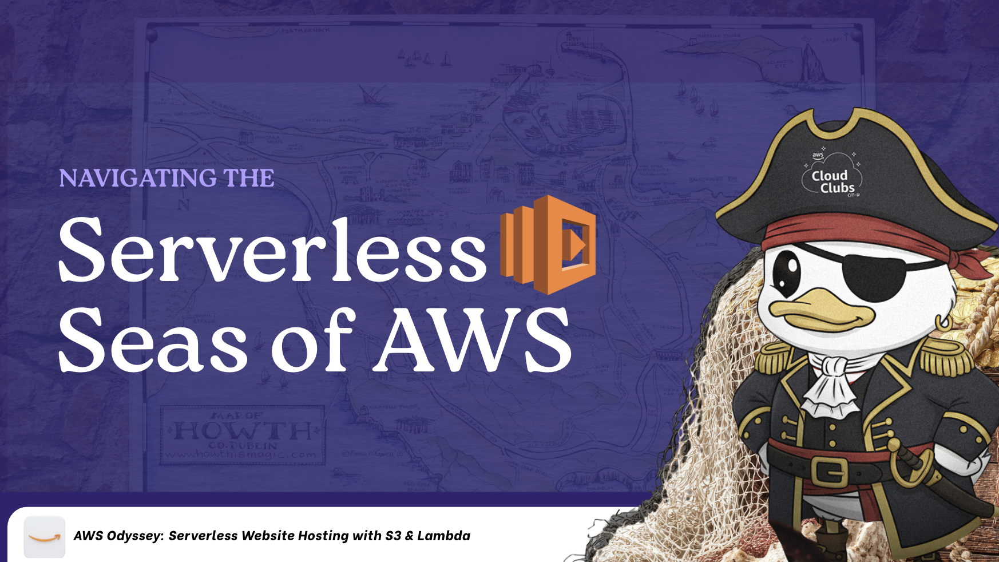

  <h1>Wanna Upload Your Cats? (AWS Workshop S3 + Lambda)</h1>

  

 

## OMG What is this?!

This repo is a hands-on workshop that incrementally wires Amazon S3 and Lambda into a Cat Upload web app:

- Upload an image (cat photo)
- Store it in S3
- Display uploaded images
- No authentication, no database

## Workshop navigator

- **Start here (workshop-wide context + notes)**: [`docs/INTRODUCTION.md`](docs/INTRODUCTION.md)
- **Lecture 1 (S3)**: [`docs/LECTURE-1-S3-README.md`](docs/LECTURE-1-S3-README.md)
- **Lecture 2 (Lambda)**: [`docs/LECTURE-2-LAMBDA-README.md`](docs/LECTURE-2-LAMBDA-README.md)

